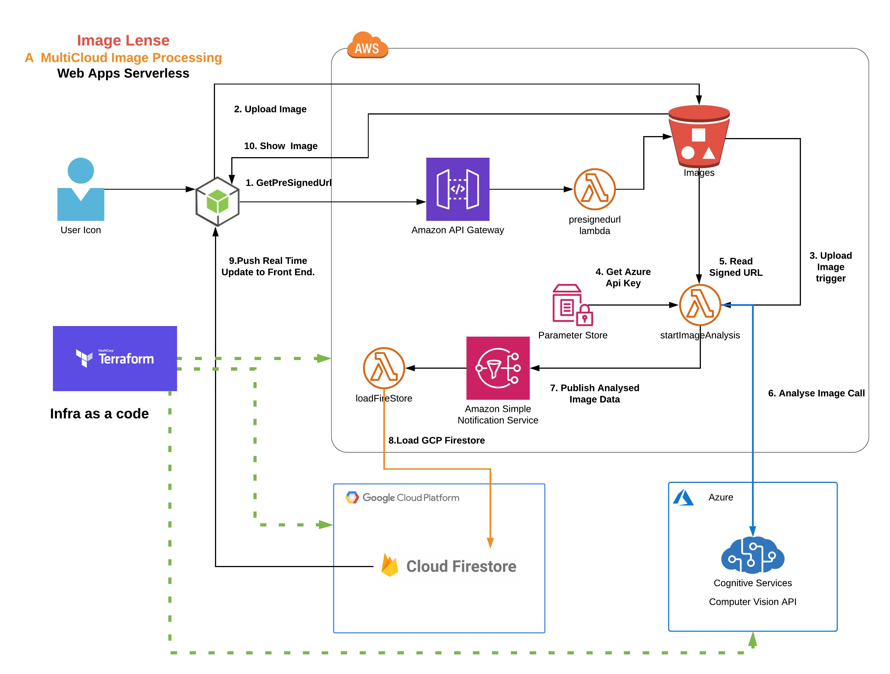
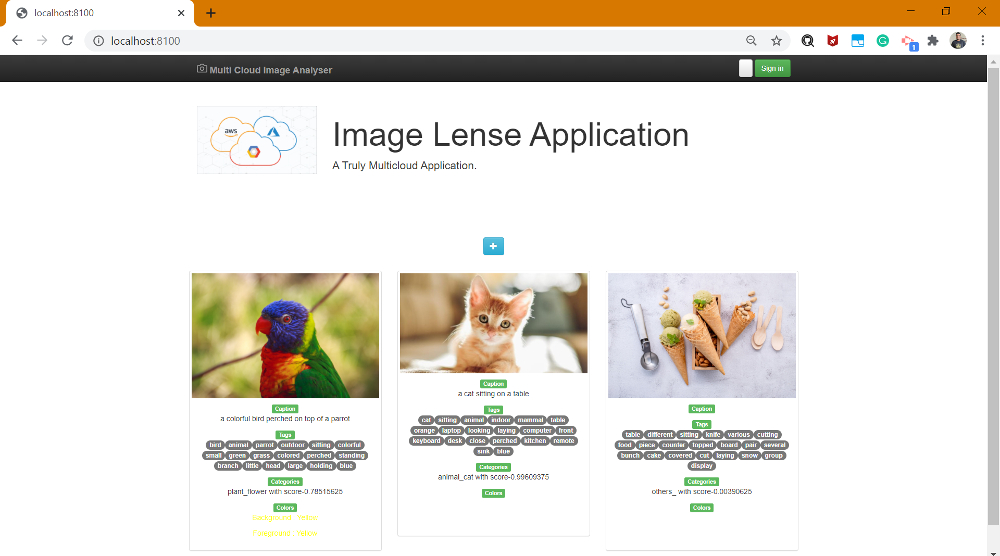

## Multi Cloud Image Processing Web Application

In this project, we would be creating a multi cloud image processing web application.

### Cloud Providers
1. AWS
2. Azure
3. GCP

### AWS 
We would be using AWS for image storage and  stitching togather web application interaction with other services.
- AWS S3 for Image Storage and Lambda Code Artificats.
- AWS Lambda for eventing the image processing application and providing secure access to S3 bucket.
- AWS API Gateway will be publishing the API for Web Application.

### Azure
We would be using Azure for image analysis.
- Azure Conginitive Service ( Computer Vision API) will be used for image processing.

### GCP
GCP would be used for realtime database.
- GCP Firestore for realtime database.

### Setup
1. Install AWS CLI and run `aws configure`  to connect AWS.
2. Use `az login -u <user> -p <password>` to connect Azure.
3. Create a service account into GCP project and download service account key json file.
4. Install gcloud and run `gcloud auth activate-service-account <service account> --key-file=<json filepath>`
5. For windows, run `$env:GOOGLE_APPLICATION_CREDENTIALS="<json file path>"`
### Architecure

### Screen

### Improvements
1. User SingUp and SignIn.
2. Authenticate API Gateway.
3. Expose Image to user via Cloud Front.
4. Blue/Green Deployment for Lambda Function.
5. Elastic Beanstalk for NodeJs Front End Application.